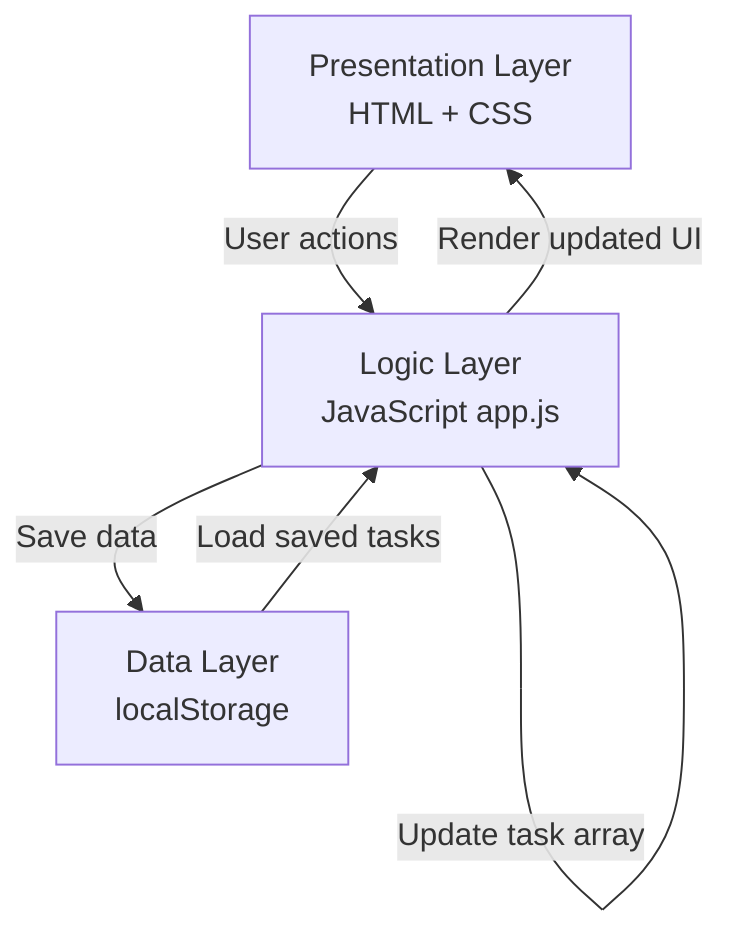
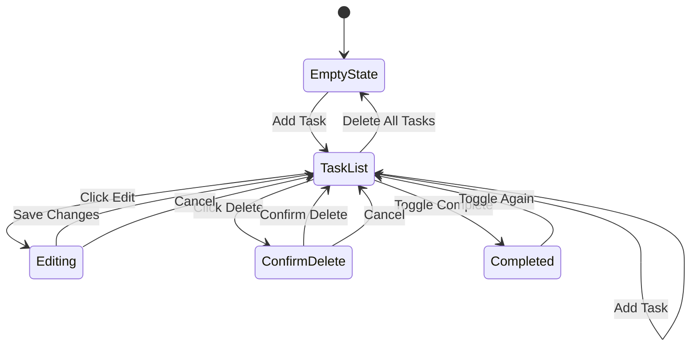
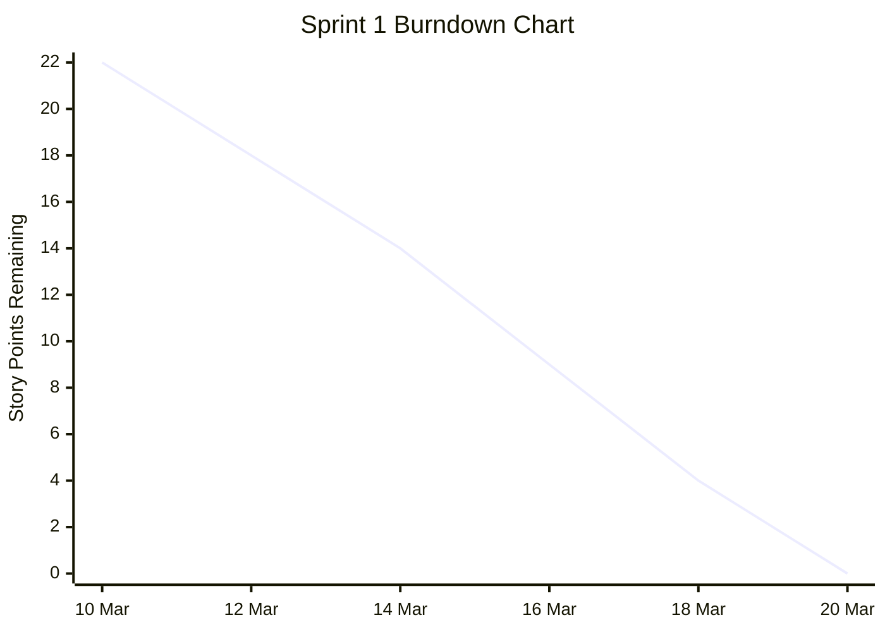

# StudyFlow — System Design Document

**A mobile-first personal task planner designed for university students**

**Student:** Shreyas Jaiswal  
**Module:** Software Development 2 (5FTC1322)  
**Date:** March 2026

---

## Table of Contents

1. [User & System Requirements](#1-user--system-requirements)
2. [Product Backlog](#2-product-backlog)
3. [Design & Development Documentation](#3-design--development-documentation)
4. [Project Management](#4-project-management)
5. [Software Tools & Techniques](#5-software-tools--techniques)
6. [Completion & Testing](#6-completion--testing)


---

# 1. User & System Requirements

## 1.1 User Requirements (User Stories)

User stories are prioritised using the **MoSCoW method**:

- **Must Have (M)** — Essential for the app to function; without these, the product has no value.
- **Should Have (S)** — Important features that add significant value but are not critical for launch.
- **Could Have (C)** — Nice-to-have features that improve the experience but can be deferred.
- **Won't Have (W)** — Out of scope for this version but considered for future development.

### Must Have

| ID | User Story | Priority |
|----|-----------|----------|
| US-01 | As a student, I want to create a task with a title and deadline, so that I can record upcoming coursework in one place. | Must |
| US-02 | As a student, I want to assign a priority level (Low, Medium, High) to each task, so that I can focus on the most urgent work first. | Must |
| US-03 | As a student, I want to tag each task with a module name, so that I can organise my workload by subject. | Must |
| US-04 | As a student, I want to mark a task as complete, so that I can track my progress and see what I have finished. | Must |
| US-05 | As a student, I want to view all my tasks for today, so that I can see what needs my attention right now. | Must |
| US-06 | As a student, I want to edit an existing task, so that I can update details if a deadline or priority changes. | Must |
| US-07 | As a student, I want to delete a task, so that I can remove items that are no longer relevant. | Must |

### Should Have

| ID | User Story | Priority |
|----|-----------|----------|
| US-08 | As a student, I want to view my tasks for the current week, so that I can plan ahead and manage my time across multiple days. | Should |
| US-09 | As a student, I want to receive a reminder notification before a deadline, so that I do not forget about upcoming submissions. | Should |
| US-10 | As a student, I want to filter my task list by module, so that I can focus on one subject at a time when studying. | Should |
| US-11 | As a student, I want to filter my task list by priority level, so that I can quickly find my most urgent tasks. | Should |

### Could Have

| ID | User Story | Priority |
|----|-----------|----------|
| US-12 | As a student, I want to see a progress summary (e.g. tasks completed vs. remaining), so that I feel motivated and can gauge how much work is left. | Could |
| US-13 | As a student, I want to sort tasks by deadline or priority, so that I can view my workload in the order that suits me best. | Could |
| US-14 | As a student, I want my tasks to be saved when I close the browser, so that I do not lose my data between sessions. | Could |
| US-15 | As a student, I want a colour-coded visual indicator for priority levels, so that I can scan my task list quickly at a glance. | Could |

### Won't Have (This Version)

| ID | User Story | Priority |
|----|-----------|----------|
| US-16 | As a student, I want to sync my tasks across multiple devices, so that I can access them from my phone and laptop. | Won't |
| US-17 | As a student, I want to share tasks or deadlines with classmates, so that we can coordinate on group work. | Won't |
| US-18 | As a student, I want to import deadlines from my university timetable automatically, so that I do not have to enter them manually. | Won't |

---

## 1.2 System Requirements

System requirements define what the application must do technically to support the user stories above.

### Functional System Requirements

| ID | Requirement | Related User Stories |
|----|------------|---------------------|
| SR-01 | The system shall allow the user to create, read, update, and delete (CRUD) tasks. Each task must store: title (text), deadline (date), priority level (Low/Medium/High), module name (text), and completion status (boolean). | US-01, US-02, US-03, US-04, US-06, US-07 |
| SR-02 | The system shall display tasks in a daily view, showing only tasks with deadlines matching the current date. | US-05 |
| SR-03 | The system shall display tasks in a weekly view, showing tasks with deadlines falling within the current Monday–Sunday period. | US-08 |
| SR-04 | The system shall allow the user to filter tasks by module name and/or priority level. | US-10, US-11 |
| SR-05 | The system shall provide visual distinction between priority levels using colour coding (e.g. green for Low, amber for Medium, red for High). | US-15 |
| SR-06 | The system shall trigger a browser notification or on-screen alert before a task's deadline (e.g. 24 hours or 1 hour before). | US-09 |
| SR-07 | The system shall persist task data using browser localStorage, so that data is retained between sessions without requiring a backend server. | US-14 |
| SR-08 | The system shall display a progress summary showing the number of tasks completed and tasks remaining. | US-12 |

### Non-Functional System Requirements

| ID | Requirement | Category |
|----|------------|----------|
| NFR-01 | The application shall be built using HTML, CSS, and JavaScript with no backend server required. | Technology |
| NFR-02 | The application shall be responsive and optimised for mobile screen sizes (360px–428px width) as the primary viewport, while remaining usable on desktop. | Usability |
| NFR-03 | The application shall load within 3 seconds on a standard mobile connection. | Performance |
| NFR-04 | The user interface shall follow a minimalist design with a calm colour palette (blues and neutrals) to reduce cognitive load. | Usability |
| NFR-05 | The application shall use clear, legible typography with a minimum font size of 16px for body text to ensure readability on small screens. | Accessibility |
| NFR-06 | All interactive elements (buttons, inputs) shall have a minimum tap target size of 44×44px to meet mobile accessibility standards. | Accessibility |
| NFR-07 | The system shall validate user input (e.g. prevent empty task titles, ensure deadlines are not in the past) and display clear error messages. | Robustness |
| NFR-08 | The codebase shall be modular, with separate files or clearly separated sections for HTML structure, CSS styling, and JavaScript logic. | Maintainability |

---


# 2. Product Backlog

## Sprint Overview

| Sprint | Duration | Focus | Goal |
|--------|----------|-------|------|
| Sprint 1 | 10–20 Mar | Core functionality | Deliver a fully working task manager with CRUD operations, priority levels, module tagging, daily view, completion tracking, and mobile-first responsive design. The app should be usable end-to-end by the end of this sprint. |

**Estimation Scale (Story Points):**
- 1 = Trivial (under 1 hour, e.g. small UI tweak)
- 2 = Small (1–2 hours, e.g. a simple feature)
- 3 = Medium (2–4 hours, e.g. a feature with some logic)
- 5 = Large (4–8 hours, e.g. a complex feature with multiple parts)
- 8 = Complex (8+ hours, e.g. a major feature requiring research and iteration)

---

## Sprint 1 — Core Functionality

### BL-01: Project setup and HTML structure
- **Related Stories:** NFR-01, NFR-08
- **Description:** Set up the project folder structure with separate HTML, CSS, and JS files. Create the base HTML page with semantic structure including a header, main content area, task list container, and a form/modal area for adding tasks.
- **Acceptance Criteria:**
  - [ ] Project contains `index.html`, `style.css`, and `app.js` as separate files
  - [ ] HTML uses semantic elements (`header`, `main`, `section`, `form`)
  - [ ] Page loads in a browser without errors
  - [ ] Basic layout structure is visible (header, content area, empty task list)
- **Story Points:** 2

---

### BL-02: Task creation form
- **Related Stories:** US-01, US-02, US-03, SR-01
- **Description:** Build a form that allows the user to create a new task by entering a title, selecting a deadline (date picker), choosing a priority level (Low/Medium/High), and entering a module name. On submission, the task should be added to the task list displayed on the page.
- **Acceptance Criteria:**
  - [ ] Form includes fields for: title (text input), deadline (date input), priority (dropdown with Low/Medium/High), and module name (text input)
  - [ ] Clicking **Add Task** creates a new task and displays it in the task list
  - [ ] The form clears after successful submission
  - [ ] Each task is stored as a JavaScript object with properties: `id`, `title`, `deadline`, `priority`, `module`, and `completed` (default: `false`)
- **Story Points:** 3

---

### BL-03: Input validation
- **Related Stories:** NFR-07
- **Description:** Add validation to the task creation form to prevent invalid or incomplete data from being submitted. Display clear, user-friendly error messages when validation fails.
- **Acceptance Criteria:**
  - [ ] The form does not submit if the title field is empty
  - [ ] The form does not submit if no deadline is selected
  - [ ] The form does not accept a deadline date in the past
  - [ ] An error message is displayed next to or below the relevant field when validation fails
  - [ ] Error messages disappear once the user corrects the input
- **Story Points:** 2

---

### BL-04: Task list display
- **Related Stories:** US-05, SR-02, SR-05
- **Description:** Display all tasks in a list/card layout. Each task card should show the title, deadline, module name, and priority level. Priority should be visually distinguished using colour coding (e.g. green for Low, amber for Medium, red for High).
- **Acceptance Criteria:**
  - [ ] All tasks currently in the array are rendered on the page
  - [ ] Each task card displays: title, deadline (formatted as a readable date), module name, and priority level
  - [ ] Priority levels are colour-coded: green (Low), amber/orange (Medium), red (High)
  - [ ] Completed tasks are visually distinct (e.g. strikethrough text or faded appearance)
  - [ ] The task list updates immediately when a new task is added
- **Story Points:** 3

---

### BL-05: Mark task as complete
- **Related Stories:** US-04, SR-01
- **Description:** Add a checkbox or button to each task card that allows the user to toggle the task's completion status. The visual appearance of the task should change to reflect whether it is complete or incomplete.
- **Acceptance Criteria:**
  - [ ] Each task has a clickable checkbox or **Complete** button
  - [ ] Clicking the checkbox toggles the task's completed status (`true`/`false`)
  - [ ] Completed tasks show a visual change (e.g. strikethrough, greyed out, or moved to a completed section)
  - [ ] The user can un-complete a task by clicking the checkbox again
- **Story Points:** 2

---

### BL-06: Edit task
- **Related Stories:** US-06, SR-01
- **Description:** Allow the user to edit an existing task's details (title, deadline, priority, module). This could be implemented as an inline edit, a pre-filled form, or a modal that opens with the task's current values.
- **Acceptance Criteria:**
  - [ ] Each task has an **Edit** button
  - [ ] Clicking **Edit** opens the task's details in an editable form pre-filled with current values
  - [ ] The user can change any field (title, deadline, priority, module) and save
  - [ ] The updated task is immediately reflected in the task list
  - [ ] Cancelling an edit does not change the task
- **Story Points:** 3

---

### BL-07: Delete task
- **Related Stories:** US-07, SR-01
- **Description:** Allow the user to delete a task from the list. Include a confirmation step to prevent accidental deletion.
- **Acceptance Criteria:**
  - [ ] Each task has a **Delete** button
  - [ ] Clicking **Delete** shows a confirmation prompt (e.g. **Are you sure?**)
  - [ ] Confirming the prompt removes the task from the list and from the data array
  - [ ] The task list re-renders immediately after deletion
  - [ ] Cancelling the prompt keeps the task unchanged
- **Story Points:** 2

---

### BL-08: Mobile-first responsive CSS
- **Related Stories:** NFR-02, NFR-04, NFR-05, NFR-06
- **Description:** Style the application with a mobile-first approach. Use a calm blue/neutral colour palette, ensure minimum font sizes and tap target sizes are met, and add media queries for larger screens.
- **Acceptance Criteria:**
  - [ ] The layout is designed for mobile viewports (360–428px) first
  - [ ] Body text is a minimum of 16px
  - [ ] All buttons and interactive elements have a minimum tap target of 44×44px
  - [ ] Colour palette uses blues and neutrals as defined in the pitch
  - [ ] A media query adjusts the layout for desktop screens (768px+)
  - [ ] No horizontal scrolling on mobile viewports
- **Story Points:** 5

---

**Sprint 1 Total: 22 story points**

---

## Future Backlog (Out of Sprint Scope)

The following items have been identified as valuable features but fall outside the scope of Sprint 1. They are documented here to demonstrate awareness of the full product vision and would be prioritised in future development cycles.

| ID | Feature | Related Stories | Story Points | Rationale for Deferral |
|----|---------|----------------|-------------|----------------------|
| BL-09 | Daily view filter (show only today's tasks) | US-05, SR-02 | 3 | Enhances navigation but the full task list is usable without it |
| BL-10 | Weekly view | US-08, SR-03 | 3 | Useful for planning ahead but not essential for core functionality |
| BL-11 | Filter by module and priority | US-10, US-11, SR-04 | 3 | Improves usability for students with many tasks; core app works without it |
| BL-12 | Sort tasks by deadline or priority | US-13 | 2 | A convenience feature that can be added once the core is stable |
| BL-13 | localStorage persistence | US-14, SR-07 | 3 | Important for real-world use but not required for a working demo |
| BL-14 | Reminder notifications | US-09, SR-06 | 5 | Technically complex (browser Notification API); deferred to keep the sprint achievable |
| BL-15 | Progress summary | US-12, SR-08 | 2 | Motivational feature; lower priority than core task management |

---

## Backlog Summary

| Category | Items | Total Story Points |
|----------|-------|--------------------|
| Sprint 1 (In Scope) | BL-01 to BL-08 | 22 |
| Future Backlog (Out of Scope) | BL-09 to BL-15 | 21 |
| **Total** | **15 items** | **43** |

### Prioritisation Rationale

Sprint 1 focuses entirely on the **Must Have** features that form the minimum viable product. Without task creation, display, editing, deletion, and completion tracking, the app cannot function at all. Mobile-first styling is included in Sprint 1 because the pitch defines StudyFlow as a mobile-first application, so the UI must reflect this from the start.

The future backlog items are ordered by value: daily/weekly views and filtering would be the next priority as they directly improve how students navigate their tasks, followed by localStorage persistence to ensure data survives between sessions, and finally reminders and progress tracking which add polish but are not required for the core workflow. Each deferred item includes a rationale to demonstrate that scope decisions were made deliberately rather than by omission.

---


# 3. Design & Development Documentation

## 3.1 Overall Design & Architecture

StudyFlow follows a **three-layer architecture** that separates concerns between presentation, logic, and data.

### Presentation Layer (HTML / CSS)

Handles the user interface. It consists of a single HTML page (`index.html`) styled by an external stylesheet (`style.css`). The page is divided into three main areas:

- dashboard that displays the task list
- task form for adding and editing tasks
- controls section for filtering and view options

The HTML uses semantic elements (`<header>`, `<main>`, `<section>`, `<form>`) for accessibility and readability.

### Logic Layer (JavaScript)

All application behaviour is handled by a single JavaScript file (`app.js`). This layer contains four logical modules:

- **Task Manager** — handles all CRUD (Create, Read, Update, Delete) operations on the task array
- **Validation** — checks user input before a task is created or updated (e.g. ensuring the title is not empty, the deadline is not in the past)
- **Renderer** — updates the DOM whenever the task data changes, re-drawing the task list and any summary information
- **Utilities** — helper functions for date formatting, generating unique task IDs, and priority colour mapping

### Data Layer (Browser localStorage)

Tasks are stored as a JSON array in the browser's `localStorage`. Every time a task is added, edited, deleted, or marked as complete, the updated array is written to `localStorage`. On page load, the app reads from `localStorage` and renders any previously saved tasks. This removes the need for a backend server while still allowing data to persist between sessions.

### File Structure

```text
StudyFlow/
├── index.html      — Page structure and content
├── style.css       — All styling and responsive design
├── app.js          — Application logic and behaviour
└── README.md       — Project documentation (this file)
```

### Data Flow

1. The user interacts with the UI (e.g. clicks **Add Task**).
2. A DOM event triggers a JavaScript function in the logic layer.
3. The function validates the input and updates the task array.
4. The updated array is saved to localStorage.
5. The renderer re-draws the task list on the page.

### Architecture Diagram



### Design Justification

The architecture follows a lightweight client-side model suitable for a single-user application. Separating presentation, logic, and data improves maintainability because each layer can be modified independently without significantly affecting the others.

Using localStorage instead of a backend reduces system complexity and setup time, which is appropriate given the scope and constraints of the project. The trade-off is reduced scalability and no cross-device access, but this is acceptable for the current version and is already acknowledged in the deferred requirements.

---

## 3.2 Development Strategy

StudyFlow is developed using an **iterative, feature-by-feature approach** within a single Scrum sprint. Rather than building the entire application at once, each backlog item is developed, tested, and completed before moving to the next. This reduces risk because the app is in a working state after each feature is added.

### Development Order

1. **Project setup and HTML structure (BL-01)** — establish the foundation before any functionality
2. **Task creation form (BL-02)** — the most fundamental feature; nothing else works without it
3. **Input validation (BL-03)** — added immediately after the form to prevent bad data from entering the system early
4. **Task list display (BL-04)** — renders the created tasks so the user gets visual feedback
5. **Mark task as complete (BL-05)** — core interaction that gives the app its primary value
6. **Edit task (BL-06)** — allows users to correct mistakes, which is essential for real-world use
7. **Delete task (BL-07)** — completes the full CRUD cycle
8. **Mobile-first responsive CSS (BL-08)** — styling is applied last to avoid rework as the HTML structure evolves during feature development

This order ensures that at any point during development, the app is functional with whatever features have been completed so far. For example, after completing BL-04, the app can already create and display tasks even though editing and deleting are not yet available.

### Version Control

Git is used throughout development with regular commits after each feature is completed. Each commit message references the relevant backlog item.

Example:
```bash
BL-02: Add task creation form with priority and module fields
```

This creates a clear development history and makes it easy to roll back if a feature introduces bugs.

---

## 3.3 Technology Stack

### Core Technologies

| Technology | Role | Justification |
|-----------|------|---------------|
| HTML5 | Page structure | Semantic elements improve accessibility and SEO. Native form elements (date picker, dropdown) reduce the need for custom components. |
| CSS3 | Styling & layout | Flexbox and media queries enable a responsive, mobile-first layout without any CSS frameworks. Custom properties (variables) allow consistent theming. |
| JavaScript (ES6+) | Application logic | Handles all interactivity, data management, and DOM manipulation. No framework is needed for an app of this scope — vanilla JS keeps the codebase lightweight and avoids unnecessary dependencies. |
| Browser localStorage | Data persistence | Stores tasks as a JSON string between sessions. Suitable for a single-user, client-side application. Avoids the complexity of setting up a backend server or database. |

### Why No Framework?

A framework like React or Vue would add unnecessary complexity for an application of this size. StudyFlow has a single page with a small number of interactive elements. Vanilla JavaScript provides full control over the DOM without the overhead of a build system, package manager, or framework-specific syntax. This also means the app can be opened directly in a browser from the file system with no server or build step required, which simplifies both development and the demo.

### Why localStorage Over a Database?

StudyFlow is a personal planner used by one student on one device. localStorage is ideal for this use case because it requires no server setup, no authentication, and no network requests. The trade-off is that data is tied to one browser on one device, but this is acceptable for the current scope. A future version could migrate to a backend database (e.g. Firebase or a REST API with SQLite) to support cross-device syncing, which is documented in the **Won't Have** requirements.

---

## 3.4 User Interface Design

### Design Principles

The UI design follows four principles identified in the project pitch:

1. **Minimalist layout** — reduce cognitive load by showing only essential information. The interface avoids clutter and uses whitespace to separate content areas clearly.
2. **Calm colour palette** — blues and neutral tones are used throughout to create a focused, low-stress environment. High-contrast colours (red, amber, green) are reserved for priority indicators.
3. **Clear typography** — a minimum font size of 16px for body text ensures readability on small screens. Headings use a clear visual hierarchy.
4. **Accessible touch targets** — all buttons and interactive elements have a minimum size of 44×44px, meeting mobile accessibility guidelines.

### Colour Palette

| Colour | Hex Code | Usage |
|--------|----------|-------|
| Dark Blue | `#1A3A5C` | Header background, primary buttons |
| Medium Blue | `#2E6B9E` | Active states, links |
| Light Blue | `#E8F0FE` | Card backgrounds, subtle highlights |
| White | `#FFFFFF` | Page background |
| Light Grey | `#F5F5F5` | Section backgrounds, disabled states |
| Dark Grey | `#333333` | Body text |
| Red | `#D9534F` | High priority indicator |
| Amber/Orange | `#F0AD4E` | Medium priority indicator |
| Green | `#5CB85C` | Low priority indicator, completed tasks |

### Screen Layout

StudyFlow is a single-page application with the following layout:

- **Header** — contains the app name (**StudyFlow**) and a summary of task completion (e.g. `3 of 7 tasks completed`)
- **Task Form Section** — a collapsible or always-visible form with fields for title, deadline, priority, and module. An **Add Task** button submits the form. When editing, the form is pre-filled with the selected task's current values and the button changes to **Save Changes**
- **Task List Section** — the main content area. Tasks are displayed as cards, each showing the title, deadline, module tag, and a colour-coded priority badge. Each card has action buttons for edit, delete, and a checkbox to mark as complete
- **Empty State** — when no tasks exist, a friendly message is displayed (e.g. `No tasks yet — add one to get started!`) to guide the user

### Responsive Design Approach

The app uses a **mobile-first** CSS strategy:

- The base styles target mobile screens (360–428px width)
- A media query at 768px adjusts the layout for tablets and desktops, such as placing the form and task list side by side instead of stacked vertically
- Flexbox is used for layout to ensure elements reflow naturally at different screen widths
- No horizontal scrolling occurs at any viewport size

---

## 3.5 State Diagram

The application has several key states that the user transitions between during normal use.

### Application States

1. **Empty State** — no tasks exist. The app displays a welcome message and the task form
2. **Task List View** — one or more tasks exist. The task list is displayed with all active and completed tasks
3. **Adding Task** — the user is filling in the task creation form
4. **Editing Task** — the user has clicked **Edit** on an existing task. The form is pre-filled with the task's current values
5. **Confirming Delete** — the user has clicked **Delete** and a confirmation prompt is shown
6. **Task Completed** — the user has toggled a task's completion status

### State Transitions

| From State | Action | To State |
|-----------|--------|----------|
| Empty State | User fills in form and clicks **Add Task** | Task List View |
| Task List View | User fills in form and clicks **Add Task** | Task List View (updated) |
| Task List View | User clicks **Edit** on a task | Editing Task |
| Editing Task | User saves changes | Task List View (updated) |
| Editing Task | User cancels | Task List View (unchanged) |
| Task List View | User clicks **Delete** on a task | Confirming Delete |
| Confirming Delete | User confirms | Task List View (task removed) |
| Confirming Delete | User cancels | Task List View (unchanged) |
| Task List View | User clicks checkbox on a task | Task Completed (visual update) |
| Task Completed | User clicks checkbox again | Task List View (un-completed) |
| Task List View | All tasks deleted | Empty State |

### State Diagram



---

## 3.6 Technical Challenges

| Challenge | Description | Planned Solution |
|-----------|------------|-----------------|
| Unique task IDs | Each task needs a unique identifier so that edit and delete operations target the correct task, even if multiple tasks have the same title. | Generate a unique ID using `Date.now()` combined with a random number. This avoids collisions without needing a database or external library. |
| Date handling | JavaScript date objects can behave inconsistently across browsers and time zones. Comparing today's date with a task's deadline needs to be reliable. | Store deadlines as `YYYY-MM-DD` strings (matching the HTML date input format). Compare dates as strings for daily view filtering, avoiding time zone issues. |
| Form reuse for add and edit | The same form is used for both creating a new task and editing an existing one. The app needs to know whether to call the add or update function on submission. | Use a flag variable (e.g. `editingTaskId = null`). If the flag is null, the form creates a new task. If it holds an ID, the form updates that task. The flag is reset after each submission. |
| Rendering performance | Re-rendering the entire task list on every change could cause flickering or lag if the list grows large. | Clear and rebuild the task list container on each render. For the expected number of tasks (under 100), this approach is performant enough. A virtual DOM or partial update would be over-engineering at this scale. |
| localStorage limits | localStorage has a ~5MB limit per domain and only stores strings. | Stringify the task array with `JSON.stringify()` before saving and parse it with `JSON.parse()` on load. 5MB is more than sufficient for thousands of text-based task objects. |
| Mobile input usability | Date pickers and dropdowns behave differently across mobile browsers. Some may not trigger native mobile pickers. | Use native HTML5 `<input type="date">` and `<select>` elements, which trigger the operating system's native pickers on most mobile browsers. Test on both iOS Safari and Android Chrome. |

---

## 3.7 Test Plan

Testing will be conducted manually by working through each backlog item's acceptance criteria. Each criterion is treated as an individual test case. Results will be recorded in a test log.

### Test Log Structure

| Column | Description |
|--------|------------|
| Test ID | Unique identifier (e.g. `T-01`) |
| Related Backlog Item | Which BL item is being tested |
| Test Description | What is being tested |
| Steps to Reproduce | Exact steps to perform the test |
| Expected Result | What should happen |
| Actual Result | What actually happened |
| Status | Pass / Fail |
| Notes | Any observations, bugs found, or fixes applied |

### Test Cases

#### BL-02: Task Creation Form

| Test ID | Test Description | Steps | Expected Result |
|---------|-----------------|-------|-----------------|
| T-01 | Create a task with all fields filled | Enter title `SD2 Report`, select deadline `25/03/2026`, set priority to `High`, enter module `Software Development 2`, click **Add Task** | Task appears in the list with all details displayed correctly |
| T-02 | Form clears after submission | Complete T-01 | All form fields are empty after the task is added |
| T-03 | Task object has correct properties | Create a task and inspect the JavaScript task array in the browser console | Object contains: `id` (number), `title` (string), `deadline` (string), `priority` (string), `module` (string), `completed` (`false`) |

#### BL-03: Input Validation

| Test ID | Test Description | Steps | Expected Result |
|---------|-----------------|-------|-----------------|
| T-04 | Submit with empty title | Leave title blank, fill other fields, click **Add Task** | Form does not submit. Error message shown near title field |
| T-05 | Submit with no deadline | Enter title, leave deadline empty, click **Add Task** | Form does not submit. Error message shown near deadline field |
| T-06 | Submit with past deadline | Enter title, select yesterday's date, click **Add Task** | Form does not submit. Error message indicates deadline must be today or later |
| T-07 | Error clears on correction | Trigger T-04, then type a title | Error message disappears |

#### BL-04: Task List Display

| Test ID | Test Description | Steps | Expected Result |
|---------|-----------------|-------|-----------------|
| T-08 | Task card shows all details | Create a task with known values | Card displays: title, formatted deadline, module name, and priority badge |
| T-09 | Priority colour coding | Create three tasks with Low, Medium, and High priority | Low shows green badge, Medium shows amber/orange, High shows red |
| T-10 | List updates immediately | Add a new task | Task appears in the list without needing to refresh the page |

#### BL-05: Mark Task as Complete

| Test ID | Test Description | Steps | Expected Result |
|---------|-----------------|-------|-----------------|
| T-11 | Toggle task to complete | Click the checkbox on an active task | Task appears faded/struck through. Completed status is `true` |
| T-12 | Toggle task back to incomplete | Click the checkbox on a completed task | Task returns to normal appearance. Completed status is `false` |

#### BL-06: Edit Task

| Test ID | Test Description | Steps | Expected Result |
|---------|-----------------|-------|-----------------|
| T-13 | Edit button opens pre-filled form | Click **Edit** on a task | Form fields are populated with the task's current values |
| T-14 | Save changes updates the task | Change the title in the edit form, click **Save Changes** | Task card shows the updated title. Other fields remain unchanged |
| T-15 | Cancel edit preserves original | Click **Edit**, change a field, then click **Cancel** | Task remains unchanged in the list |

#### BL-07: Delete Task

| Test ID | Test Description | Steps | Expected Result |
|---------|-----------------|-------|-----------------|
| T-16 | Delete shows confirmation | Click **Delete** on a task | A confirmation prompt appears (e.g. `Are you sure you want to delete this task?`) |
| T-17 | Confirm delete removes task | Click **Delete**, then confirm | Task is removed from the list |
| T-18 | Cancel delete preserves task | Click **Delete**, then cancel | Task remains in the list |

#### BL-08: Mobile-First Responsive CSS

| Test ID | Test Description | Steps | Expected Result |
|---------|-----------------|-------|-----------------|
| T-19 | Mobile layout renders correctly | Open the app in Chrome DevTools at `375px` width (iPhone SE) | Layout is single-column, no horizontal scrolling, text is readable |
| T-20 | Desktop layout adapts | Open the app at `1024px` width | Layout adjusts (e.g. form and list side by side) |
| T-21 | Touch targets are accessible | Inspect button sizes on mobile view | All buttons and interactive elements are at least `44×44px` |
| T-22 | Colour palette matches design | Visual inspection | Header uses dark blue, cards use light blue/white, priorities are colour-coded |

### Test Log (to be completed during testing)

| Test ID | BL | Status | Actual Result | Date | Notes |
|---------|-----|--------|---------------|------|-------|
| T-01 | BL-02 | | | | |
| T-02 | BL-02 | | | | |
| T-03 | BL-02 | | | | |
| T-04 | BL-03 | | | | |
| T-05 | BL-03 | | | | |
| T-06 | BL-03 | | | | |
| T-07 | BL-03 | | | | |
| T-08 | BL-04 | | | | |
| T-09 | BL-04 | | | | |
| T-10 | BL-04 | | | | |
| T-11 | BL-05 | | | | |
| T-12 | BL-05 | | | | |
| T-13 | BL-06 | | | | |
| T-14 | BL-06 | | | | |
| T-15 | BL-06 | | | | |
| T-16 | BL-07 | | | | |
| T-17 | BL-07 | | | | |
| T-18 | BL-07 | | | | |
| T-19 | BL-08 | | | | |
| T-20 | BL-08 | | | | |
| T-21 | BL-08 | | | | |
| T-22 | BL-08 | | | | |

---


# 4. Project Management

*This section will be completed throughout the sprint with evidence of regular reviews and progress tracking.*

## 4.1 Sprint Review Meetings

Document each review meeting with the following format:

### Review 1 — Sprint Planning (Date: __)

**What was done since the last meeting:**
- Starting point — no previous work

**What is planned for this session:**
- 

**Current problems and barriers:**
- 

---

### Review 2 — Mid-Sprint Check (Date: __)

**What was done since the last meeting:**
- 

**What is planned for this session:**
- 

**Current problems and barriers:**
- 

---

### Review 3 — Sprint Review & Retrospective (Date: __)

**What was done since the last meeting:**
- 

**What is planned for this session:**
- 

**Current problems and barriers:**
- 

**Retrospective — what went well and what could be improved:**
- 

---

## 4.2 Burndown Chart



Track the completion of story points over the sprint duration:

| Date | Story Points Remaining | Notes |
|------|----------------------|-------|
| 10 Mar | 22 | Sprint start |
| 12 Mar | 18 | Project setup and task form underway |
| 14 Mar | 14 | Validation and task rendering added |
| 16 Mar | 9 | Completion toggle and edit function progressed |
| 18 Mar | 4 | Delete function and responsive CSS nearly complete |
| 20 Mar | 0 | Sprint end (target) |

---

## 4.3 Backlog Reviews

Document any changes to the backlog during the sprint (e.g. items re-prioritised, acceptance criteria updated, new items added).

| Date | Change | Reason |
|------|--------|--------|
| | | |

---


# 5. Software Tools & Techniques

*Document the tools and coding techniques used throughout development.*

## 5.1 Development Tools

| Tool | Purpose | Why Chosen |
|------|---------|------------|
| Visual Studio Code | Code editor | Lightweight, built-in terminal, extensive extension support, IntelliSense for HTML/CSS/JS |
| Google Chrome DevTools | Debugging & testing | DOM inspection, console for JS debugging, device emulation for responsive testing |
| Git | Version control | Track changes, commit history per feature, ability to roll back |
| GitHub | Remote repository | Hosts the project, provides backup, submission via repo link |
| Live Server (VS Code extension) | Local development server | Auto-refreshes the browser on save, speeds up development workflow |

## 5.2 Coding Techniques

| Technique | Where Used | Benefit |
|-----------|-----------|---------|
| DOM manipulation | Rendering tasks, updating UI | Direct control over page content without a framework |
| Event listeners | Form submission, button clicks, checkbox toggles | Clean separation between HTML structure and JS behaviour |
| Array methods (`filter`, `map`, `find`, `findIndex`) | Task filtering, searching, rendering | Concise and readable data operations |
| Template literals | Building HTML strings for task cards | Cleaner string construction with embedded expressions |
| Destructuring | Extracting task properties | Shorter, more readable code when working with task objects |
| `JSON.stringify()` / `JSON.parse()` | localStorage read/write | Converts task array to/from storable string format |
| CSS custom properties (variables) | Colour palette, spacing | Consistent theming; easy to update colours in one place |
| CSS Flexbox | Page layout, card layout, form layout | Responsive alignment without floats or complex positioning |
| Media queries | Responsive breakpoints | Adapts layout from mobile to desktop at `768px` |
| Semantic HTML | Page structure | Improves accessibility for screen readers and SEO |

---
